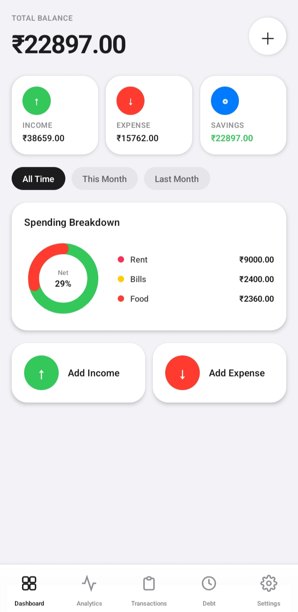
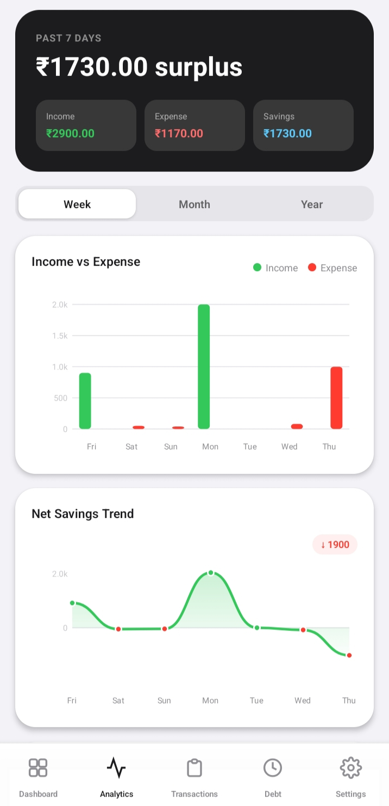
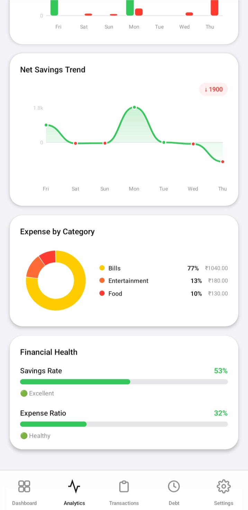
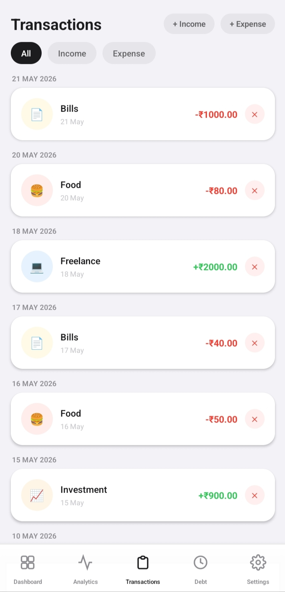

<h1 align="center">
  
   
  Rupeer
</h1>

  <strong>Track Every Rupee. Build Better Financial Habits.</strong>

  A simple, fast, and privacy-first personal finance tracker for Android.

---

## 📱 Download

Download the latest APK from the **Releases** section.

> ⚠️ Source code is **not publicly available**. This repository is provided for application releases, screenshots, feature updates, and documentation only.

---

# Features

- 💸 Track income and expenses
- 📊 Beautiful analytics dashboard
- ❤️ Financial health score
- 📈 Savings and expense trends
- 🏷️ Custom income & expense labels
- ⚡ Quick transaction logging
- 📅 Weekly, Monthly & Yearly reports
- 🔒 100% Local Storage (No Cloud)

---

# 📸 Screenshots

| Dashboard                                       | Analytics                                       |
| ----------------------------------------------- | ----------------------------------------------- |
|  |  |

| Insights                                       | Transactions                                       |
| ---------------------------------------------- | -------------------------------------------------- |
|  |  |

---

# 🚀 Upcoming Features

Rupeer is continuously improving.

Future updates include:

- ☁️ Cloud Backup & Sync
- 👥 Multi-device Support
- 🎯 Savings Goals
- 📤 Export PDF & CSV
- 🔔 Bill & Payment Reminders
- 📈 Advanced Financial Reports
- 🤖 Smart Spending Insights
- 🌙 More Personalization

---

# 🔒 Privacy

Rupeer is designed with privacy first.

- ✅ No Sign Up
- ✅ No Login
- ✅ No Ads
- ✅ No Tracking
- ✅ No Cloud Storage
- ✅ Everything stays on your device

---

# 📦 Distribution

This repository contains:

- APK Releases
- Screenshots
- Changelog
- Documentation

**The application source code is private and is not included in this repository.**

---

# 🛠️ Built With

- React native

---

# 👨‍💻 Developer

**Dravid P A**

If you enjoy Rupeer, consider giving this repository a ⭐.

---

Made with ❤️ for better financial habits.

